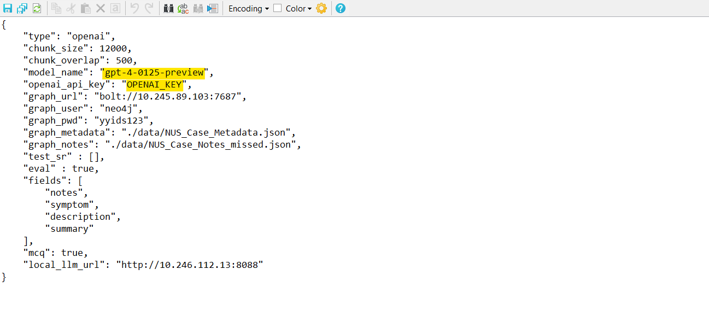
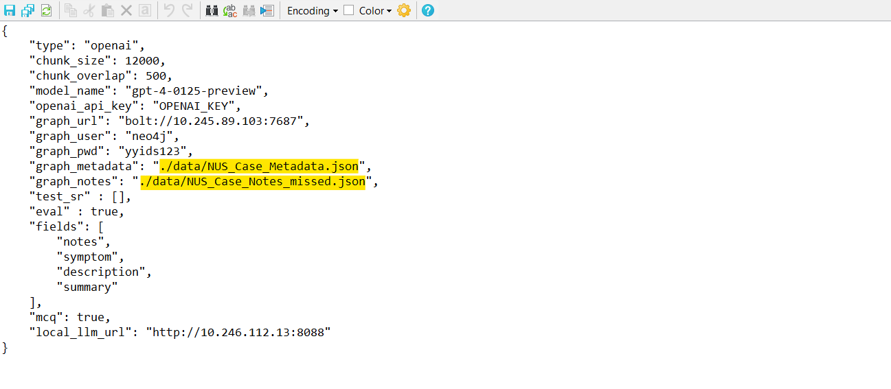
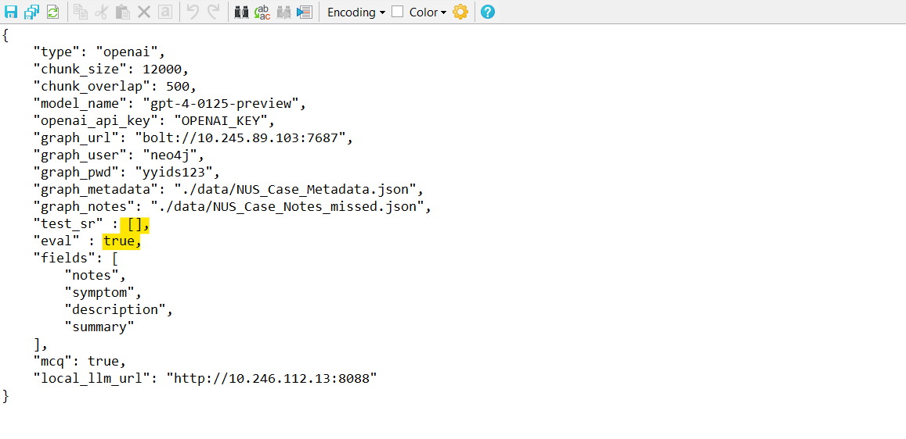
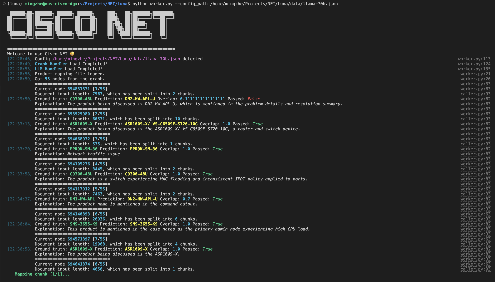

# Welcome to Luna 🔮

### Step 0. Prepare Environment
```shell
conda create -n luna python=3.9
conda activate luna
pip install -r requirements.txt
mkdir results
```

### Step 1. Set up Containers (Optional)
In most cases, you don't need to do this section by yourself. However, if you are curious, there is something you can check out:
* Knowledge Graph Installation (see section 'Installation' in https://shorturl.at/lyKTZ)
* LLM Inference Engine (run 'start_llm.sh'. For local models only)

You can also try the LLM inference engine by CURL:
```
curl 10.246.112.13:8080/generate \
    -X POST \
    -d '{"inputs":"What is Deep Learning?","parameters":{"max_new_tokens":20}}' \
    -H 'Content-Type: application/json'
```

### Step 2. Change the config file
#### Adding the OpenAi Key and choosing the inference model 



First you have to replace the open_ai_key field in the config file by your own openai key, see more details at the [openai website](https://platform.openai.com/api-keys)
Second, you have to replace the model_name field in the config file with a valid openai model name. It is highly advised to use ```gpt-4-0125-preview``` or ```gpt-3.5-turbo-0125``` models.

#### Changing the metadata files and the case notes files



You have to change the ```graph_metadata``` and the ```graph_notes``` fields in the config file with the paths to you json file containing the metadata and the case notes data respectively. 

#### Further config changes



You can change the ```test_sr``` field in the config file, by specifying the SRs for which you want to test, if you keep this field as an empty list [], the cli will test for all the SRs present in the metadata files that have case notes in the casenote file

The ```eval``` flag in the config file should be set to true if the user want to evaluate the performance of the model. for the inference case, set this flag to false.

### Step 3. Run the Code
#### Graph Construction Task
To use pre-defined config in the 'data' folder, please try:
```shell
python cli_worker.py --config_path [CONFIG_PATH] --task graph
```

If you would like to use other metadata/notes, please run:
```shell
python cli_worker.py --task graph
```

#### Product_Name/Software_version Inference Task
If you would like to use pre-defined config in the 'data' folder, please try:
```shell
python cli_worker.py --config_path [CONFIG_PATH] --task [product/software]
```

Otherwise, you can also try this one. The script will help you to generate the config:
```shell
python cli_worker.py --task [product/software]
```

Please feel free to let me know if you have any concerns. Thank you!
Email: mingzhe@nus.edu.sg

---

Watch the demo video ⬇️

[](https://www.youtube.com/watch?v=ZA4cExEgurE)
